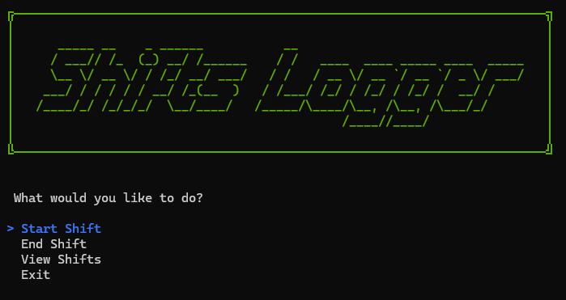

# Shifts Logger

A full-stack C# application designed to track worker shifts. This project demonstrates a separation of concerns by splitting the solution into a **RESTful Web API** backend and a **Console-based User Interface** frontend. This is a project for the [C# Academy](https://www.thecsharpacademy.com/project/17/shifts-logger).

## Features

- **Start/Stop Shifts:** Real-time clock-in and clock-out functionality.
- **Duration Calculation:** Automatically calculates the duration of completed shifts.
- **CRUD Operations:** View history, update shift details, and delete entries.
- **Modern UI:** Uses `Spectre.Console` for an interactive and visually appealing command-line interface.
- **Data Persistence:** Stores data using SQL Server and Entity Framework Core.
- **Data Resilience:** if the app is closed or crashed, both the UI and the API, your shift won't be lost once it's started.

## Technologies Used

- **.NET 9**
- **ASP.NET Core Web API**
- **Entity Framework Core** (Code-First Approach)
- **SQL Server** (LocalDB)
- **Spectre.Console** (UI Library)
- **HttpClient** (API Consumption)

## Project Structure

The solution is divided into two main projects:

1.  **ShiftsLogger.API**: Handles database connections, business logic, and exposes endpoints.
    - _Controllers_: Manage HTTP requests.
    - _Services_: Handle business logic (e.g., ensuring you can't start a shift if one is already open).
    - _Context_: EF Core database context and seeding.
2.  **ShiftsLogger.UI**: A console application that acts as the client.
    - _Services_: Handles HTTP communication with the API.
    - _Controllers_: Manages the UI flow and user input.
    - _Models_: DTOs for data transfer.

## Getting Started

### Prerequisites

- .NET SDK
- SQL Server (or LocalDB)

### Running the Project

To run the project to the following:

- Restore dependencies, on PowerShell `Restore` 
- Update the database `Update-Database`
- Run the project, on Visual Studio press `F5`.

The project runs at `http://localhost:5111` by default. You can change this by modifying
both `lauchSettings.json` in the **API** project and the
`appsettings.json` in the **UI** project.

## Usage

1.  **Start Shift**: Creates a new record with the current time.
2.  **Stop Shift**: Finds the currently open shift and closes it, calculating the duration.
3.  **View Shifts**: Lists all past shifts. You can select a specific shift to **Edit** or **Delete** it.

## License

This project is open-source and available under the [MIT License](https://opensource.org/license/mit).
